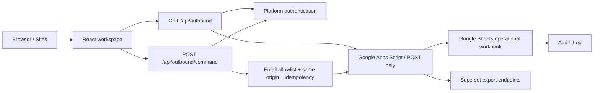

# CBT Outbound Operations Hub

Command center untuk memonitor, merencanakan, dan mengeksekusi operasi outbound pada grain yang benar: **Supply Order × Picking Zone**. Aplikasi menggabungkan status SO, Wave/Drop, eligibility picker, target manpower, checker route, audit, dan Bulk Upload WMS dalam satu antarmuka responsif.

Versi ini sengaja mempertahankan struktur data bisnis yang ada. Perubahan skema, migrasi field, atau pemindahan source of truth dapat dilakukan pada fase berikutnya tanpa bercampur dengan perbaikan UI, performa, keamanan, dan reliability.

## Status implementasi

- UI tujuh area operasional dengan desain system yang konsisten.
- state workspace terpusat dan tidak reset saat berpindah route;
- live read melalui proxy server, dengan sample fallback yang diberi label jelas;
- command write terautentikasi, memakai allowlist, same-origin, dan idempotency key;
- Google Apps Script melakukan mutasi nyata dan audit, bukan sekadar menerima command;
- guardrail Bulk Upload memvalidasi seluruh split dari SO yang disentuh;
- tabel Planning dan SO Explorer dipaginasi;
- spatial operations map memakai CSS transform, tanpa WebGL atau library animasi;
- `prefers-reduced-motion` dihormati;
- production assets dilayani oleh Wrangler;
- unit test, rendered-route test, asset test, lint, typecheck, dan CI tersedia;
- dependency produksi: `npm audit --omit=dev` = 0 vulnerability pada verifikasi terakhir.

## Prinsip domain yang tidak boleh dilanggar

### 1. Grain planning

Satu SO dapat memiliki produk dari beberapa Picking Zone. Unit planning adalah:

```text
so_number × picking_zone
```

`distinct SO` dan `SO-zone split` harus selalu dilaporkan terpisah.

### 2. Eligibility picker

Picker hanya eligible bila seluruh kondisi berikut terpenuhi:

```text
is_active = true
checkin_time terisi
schedule_start_time terisi
schedule_role = OUTBOUND_PICKER_STAFF
schedule_description bukan Off Day
tenure_days >= 1
zone skill tidak kosong dan mencakup zona order
shift picker = shift order
```

### 3. MP Status

Boundary tenure dibuat tidak overlap:

| Tenure | MP Status |
|---|---|
| hari 1–7 | OJT 1 |
| hari 8–14 | OJT 2 |
| hari 15–20 | OJT 3 |
| hari 21+ | REGULER |

`mp_status_override` boleh digunakan untuk koreksi operasional, tetapi hasil tenure tetap harus tersedia untuk audit.

### 4. Wave dan Drop

Wave/Drop tidak diasumsikan berasal dari raw SO. Source of truth adalah konfigurasi destination bulanan:

```text
effective_month
destination_code
destination_location_name
wave
drop
sequence
active
```

Rule aktif paling baru yang tidak melewati bulan operasi digunakan. Destination tanpa rule menjadi `UNMAPPED` dan tidak boleh masuk assignment otomatis.

### 5. Kontrak Bulk Upload WMS

Output final tetap tiga kolom:

```csv
error_message,so_id,staff_id
```

Satu `so_id` hanya boleh menghasilkan satu `staff_id`. Sebelum row berstatus `READY`, sistem memeriksa:

- semua split NEW yang belum memiliki picker ikut dievaluasi;
- tidak ada proposal `UNASSIGNED`;
- tidak ada picker berbeda pada split SO yang sama;
- tidak ada proposal `OVER_TARGET_REVIEW`;
- satu SO tidak membawa beberapa `so_id`;
- satu `so_id` tidak dimiliki beberapa `so_number`;
- destination sudah memiliki Wave/Drop.

CSV juga menetralkan prefix formula spreadsheet (`=`, `+`, `-`, `@`, tab, atau carriage return).

## Arsitektur



### Mode data

`OutboundProvider` mencoba membaca:

```http
GET /api/outbound?resource=dataset
```

Jika source live valid, UI masuk **Live mode**. Jika auth, env, jaringan, atau kontrak dataset belum siap, aplikasi tetap dapat dievaluasi memakai **Sample fallback** dan menampilkannya secara eksplisit. Fallback bukan data produksi dan command-nya hanya mengubah state browser.

### Alur command

1. browser membuat `Idempotency-Key`;
2. proxy memvalidasi user platform;
3. proxy memeriksa `OUTBOUND_COMMAND_ALLOWED_EMAILS`;
4. request lintas-origin ditolak;
5. payload dan jumlah row dibatasi;
6. token server diteruskan ke Apps Script;
7. Apps Script mengambil script lock;
8. duplicate key dikembalikan sebagai sukses tanpa mengulang mutasi;
9. sheet diperbarui dan event ditulis ke `Audit_Log`;
10. browser memuat ulang dataset live.

## Struktur proyek

```text
app/
  (dashboard)/             route operasional
  api/outbound/            read proxy
  api/outbound/command/    command proxy
components/
  layout/app-shell.tsx     shell, navigation, quick switch, sync, toast
  outbound/
    outbound-provider.tsx  shared state, live/fallback, commands
    outbound-workspace.tsx seluruh operational views
  ui/primitives.tsx        reusable UI primitives
google-apps-script/
  Code.gs                  sync, dataset API, command mutations, audit
  appsscript.json          manifest dan scopes
lib/
  demo-data.ts             deterministic fallback dataset
  outbound-logic.ts        pure business logic dan CSV
  outbound-types.ts        domain contract
tests/
  outbound-logic.test.mjs  unit tests untuk guardrail
  rendered-html.test.mjs   SSR, auth, routes, headers, assets
worker/index.ts            Cloudflare Worker entry + security headers
.github/workflows/ci.yml   quality gate
```

Scaffold D1 tetap tersedia tetapi belum aktif. `.openai/hosting.json` memakai `d1: null` dan `r2: null`; data operasional saat ini tetap Google Sheets.

## Prasyarat

- Node.js `>=22.13.0`;
- npm yang kompatibel dengan lockfile v3;
- Google Sheet dengan sheet contract di bawah;
- akses membuat Apps Script Web App;
- dua Superset export URL HTTPS bila sync otomatis diaktifkan;
- Sites/ChatGPT authentication untuk production command.

Verifikasi:

```powershell
node --version
npm --version
```

## Menjalankan lokal

### 1. Install dependency terkunci

```powershell
npm ci
```

Gunakan `npm ci`, bukan `npm install`, pada CI dan deployment agar versi mengikuti `package-lock.json`.

### 2. Buat environment lokal

```powershell
Copy-Item .env.example .env.local
```

Isi `.env.local`:

| Variable | Wajib | Keterangan |
|---|---:|---|
| `OUTBOUND_GAS_ENDPOINT` | untuk live read | URL `/exec` Apps Script |
| `OUTBOUND_GAS_TOKEN` | untuk live read | token minimal 20 karakter |
| `OUTBOUND_ALLOW_ANONYMOUS_READ` | lokal saja | `true` bila ingin menguji read tanpa auth platform |
| `OUTBOUND_COMMAND_GAS_ENDPOINT` | untuk write | endpoint command; boleh sama dengan read |
| `OUTBOUND_COMMAND_GAS_TOKEN` | untuk write | token Apps Script command |
| `OUTBOUND_COMMAND_ALLOWED_EMAILS` | untuk write | email operator, dipisahkan koma |

Jangan commit `.env.local`, token, Superset credential, atau file credential lain.

### 3. Jalankan development server

```powershell
npm run dev
```

Buka URL yang ditampilkan terminal. Tanpa live source, banner akan menunjukkan `Sample fallback`.

### 4. Quality gate

```powershell
npm run typecheck
npm run lint
npm test
npm audit --omit=dev
```

`npm test` membangun aplikasi lalu menjalankan:

- boundary MP Status;
- deadline Asia/Jakarta dan night-shift rollover;
- picker eligibility;
- incomplete multi-zone selection;
- over-target block;
- collision `so_id`;
- CSV injection protection;
- SSR seluruh route;
- unauthenticated API rejection;
- production asset existence.

### 5. Uji production runtime lokal

```powershell
npm run build
npm start
```

`npm start` menjalankan Wrangler menggunakan `dist/server/wrangler.json`. Ini penting karena asset production berada di `dist/client`; `vinext start` tidak digunakan sebagai production handoff proyek ini.

## Menyiapkan Google Sheet

Workbook operasional tidak menyimpan secret. Gunakan workbook CBT yang ada atau buat workbook baru dengan sheet berikut:

| Sheet | Fungsi |
|---|---|
| `Settings` | operation date dan last sync |
| `Raw_SO` | hasil export SO Superset |
| `Raw_Staff` | hasil export staff Superset |
| `Config_Wave_Drop` | mapping destination bulanan |
| `Config_Target` | target per MP Status |
| `Staff_Roster` | roster turunan/operasional |
| `SO_Zone_Split` | aggregate SO × zone |
| `Assignment_Plan` | suggested/manual picker |
| `Bulk_Upload` | output tiga kolom WMS |
| `Audit_Log` | audit event |
| `Checker_Routes` | opsional; diperlukan untuk command checker live |

Sheet turunan boleh memakai formula, tetapi header yang dibaca Apps Script harus stabil. Normalisasi reader mendukung snake_case/camelCase umum, namun perubahan arti field tetap harus melalui migrasi kontrak.

### Header minimal Raw SO

```text
so_date
supply_order_created_at
so_number
destination_location_name
status
origin_rack_name
picking_area_name
SUM(request_quantity)
```

### Header minimal Raw Staff

```text
date_key
drivers_join_date
schedule_start_time
staff_id
staff_name
schedule_role
schedule_description
checkin_time
is_active
```

### Header command penting

`Assignment_Plan` minimal memiliki:

```text
so_number
picking_zone
manual_override_staff_id
```

`Audit_Log` disarankan:

```text
event_id
created_at
actor
action
status
detail
```

## Memasang Google Apps Script

### 1. Buat project bound script

1. buka workbook;
2. pilih **Extensions → Apps Script**;
3. ganti isi editor dengan `google-apps-script/Code.gs`;
4. buka manifest dan salin `google-apps-script/appsscript.json`;
5. simpan.

### 2. Tambahkan Script Properties

Di **Project Settings → Script Properties**, isi:

```text
SUPERSET_SO_EXPORT_URL
SUPERSET_STAFF_EXPORT_URL
SUPERSET_ACCESS_TOKEN
OUTBOUND_API_TOKEN
```

Gunakan token acak minimal 20 karakter. `doGet` sengaja dinonaktifkan agar token tidak masuk URL, browser history, atau access log.

### 3. Otorisasi dan validasi

Jalankan manual secara berurutan:

1. `validateSourceSheets`;
2. `refreshCalculations`;
3. `syncSuperset`.

Periksa `Audit_Log` setelah setiap langkah. Sync memakai script lock, membatasi export 45 MB, memvalidasi header, mengganti raw sheet secara batch, melakukan flush formula, lalu mencatat hasil.

### 4. Pasang trigger

Jalankan:

```text
installSyncTrigger
```

Fungsi ini menghapus trigger `syncSuperset` lama lalu membuat trigger 15 menit, sehingga tidak terjadi trigger duplikat.

### 5. Deploy Web App

1. klik **Deploy → New deployment**;
2. pilih **Web app**;
3. execute as: akun pemilik workbook operasional;
4. batasi akses sesuai kebijakan organisasi;
5. deploy;
6. salin URL yang berakhir `/exec`;
7. isi URL dan token pada environment aplikasi;
8. setiap perubahan Apps Script memerlukan deployment version baru.

### 6. Smoke test proxy

Dengan app lokal aktif:

```powershell
Invoke-WebRequest `
  -Uri "http://localhost:3000/api/outbound?resource=health" `
  -Headers @{ Accept = "application/json" }
```

Port development dapat berbeda; gunakan URL dari terminal. Bila anonymous read tidak diaktifkan, uji melalui environment Sites yang sudah login.

## API contract

### Read

```http
GET /api/outbound?resource=dataset
GET /api/outbound?resource=staffRoster&page=1&pageSize=100
GET /api/outbound?resource=sos&status=NEW&shift=PAGI
GET /api/outbound?resource=destinationRules&month=2026-07
```

Resource bersifat allowlisted dan alias case-insensitive dinormalisasi ke nama canonical. Response besar dibatasi 3 MB dan tidak di-cache.

### Command

```http
POST /api/outbound/command
Content-Type: application/json
Idempotency-Key: assignBatch:2026-07-28:<uuid>
```

Contoh payload:

```json
{
  "action": "assignBatch",
  "rows": [
    {
      "orderId": "SO-100::MZA1",
      "soNumber": "SO-100",
      "zone": "MZA1",
      "pickerId": "STF-001"
    }
  ]
}
```

Maksimum 500 row per command. Jangan memanggil Apps Script langsung dari browser karena itu akan mengekspos token.

## UI/UX dan performa

- spatial map hanya memakai CSS `transform` dan `opacity`;
- tidak ada dependency charting/3D tambahan;
- animasi berhenti efektif pada `prefers-reduced-motion`;
- route state berada pada provider layout;
- Planning merender maksimal 30 row per halaman;
- SO Explorer merender maksimal 50 row per halaman;
- section di bawah viewport memakai `content-visibility: auto`;
- font lokal memakai `font-display: swap`;
- angka memakai tabular numerals;
- modal memiliki `role=dialog`, label, Escape close, dan focus restoration;
- quick switch tersedia dengan `Ctrl+K` atau `Cmd+K`;
- theme disimpan di local storage;
- API dan Worker mengirim `no-store`, `nosniff`, frame denial, referrer policy, dan permissions policy.

Open Graph v2 berada di `public/og-spatial.png` dengan ukuran 1200×630 dan telah dioptimasi menjadi sekitar 390 KB. Aset ini hanya dimuat oleh crawler social, bukan pada interaksi dashboard biasa.

## Continuous Integration

Workflow `.github/workflows/ci.yml` berjalan pada pull request dan push ke `main`:

1. `npm ci`;
2. typecheck;
3. lint;
4. production build + tests;
5. production dependency audit.

PR tidak boleh digabung bila quality gate gagal.

## Deployment yang direkomendasikan: Sites

Project memiliki `.openai/hosting.json`, sehingga Sites adalah jalur deployment utama.

### First deployment

1. pastikan seluruh quality gate lulus;
2. pastikan tidak ada secret di Git;
3. buat Sites project satu kali;
4. simpan `project_id` yang dikembalikan ke `.openai/hosting.json`;
5. commit source state yang tepat;
6. push commit tersebut memakai credential Sites;
7. package source dari commit yang sama;
8. save version dengan `commit_sha`;
9. deploy version sebagai **private**;
10. tunggu status terminal dan lakukan smoke test URL production.

Jangan membuat Sites project baru untuk deployment berikutnya. Selalu gunakan `project_id` yang sudah tersimpan.

### Deployment berikutnya

1. jalankan quality gate;
2. commit perubahan;
3. push exact source state;
4. package source;
5. save version baru;
6. deploy version tersebut;
7. cek status dan smoke test.

### Environment production

Tambahkan seluruh variable pada bagian “Menjalankan lokal” sebagai runtime environment di Sites. Nilai command allowlist wajib ada; tanpa itu command endpoint sengaja mengembalikan `503 COMMAND_AUTHORIZATION_NOT_CONFIGURED`.

### Rollback

1. pilih Sites version terakhir yang sehat;
2. deploy ulang version tersebut;
3. jangan mengubah workbook selama investigasi bila ada kemungkinan command parsial;
4. cocokkan `idempotency_key` dan event pada `Audit_Log`;
5. perbaiki source pada branch baru, jalankan quality gate, lalu rilis version berikutnya.

Semua URL deployment Sites adalah production URL. Gunakan private deployment kecuali akses publik benar-benar diminta.

## Alternatif Cloudflare manual

Build:

```powershell
npm ci
npm test
npx wrangler deploy --config dist/server/wrangler.json
```

Set secret dengan Wrangler sebelum deploy. Namun command production di luar Sites memerlukan lapisan identity yang tervalidasi dan pemetaan header auth yang aman. Jangan mengaktifkan anonymous command atau mempercayai header email dari client. Untuk penggunaan read-only, `OUTBOUND_ALLOW_ANONYMOUS_READ=true` dapat dipakai setelah review risiko data.

## Monitoring dan operasi

Pantau:

- HTTP 5xx dan latency `/api/outbound`;
- timeout Apps Script;
- umur `syncedAt`;
- jumlah destination `UNMAPPED`;
- duplicate SO-zone;
- collision `so_id`;
- picker tanpa zone skill;
- command gagal/duplicate;
- row Bulk Upload blocked;
- pertumbuhan ukuran response dataset.

Rekomendasi alert:

| Kondisi | Severity |
|---|---|
| sync lebih lama dari 30 menit | warning |
| header source hilang | critical |
| `UNMAPPED` bertambah | warning |
| collision `so_id` | critical |
| command failure | critical |
| response dataset mendekati 3 MB | warning |

## Troubleshooting

### UI selalu Sample fallback

Periksa:

1. env endpoint/token;
2. endpoint harus HTTPS `script.google.com/macros/s/.../exec`;
3. Apps Script sudah di-deploy ulang;
4. `OUTBOUND_ALLOW_ANONYMOUS_READ` untuk local;
5. response `resource=dataset` memiliki seluruh array contract.

### Command mendapat 403

- user belum login;
- email tidak ada pada `OUTBOUND_COMMAND_ALLOWED_EMAILS`;
- request berasal dari origin berbeda.

### Command mendapat 503

- command allowlist belum dikonfigurasi;
- command endpoint/token tidak ada;
- Apps Script deployment tidak dapat diakses.

### Assignment tidak menemukan row

Pastikan kombinasi `so_number + picking_zone` di `Assignment_Plan` identik dengan data dari browser.

### Checker live gagal

Tambahkan sheet `Checker_Routes` dengan kolom `id` atau `route_id`, `status`, dan `updated_at`. Tanpa sheet tersebut, command checker sengaja gagal agar tidak menghasilkan sukses palsu.

### Asset 404 setelah build

Gunakan:

```powershell
npm start
```

Jangan menjalankan `vinext start` sebagai production runtime proyek ini. Wrangler membaca asset binding `../client` dari `dist/server/wrangler.json`.

## Checklist UAT

- [ ] distinct SO berbeda dari SO-zone split;
- [ ] hanya status NEW masuk pool;
- [ ] picker noneligible tidak pernah direkomendasikan;
- [ ] split parsial memblokir Bulk Upload;
- [ ] over-target memerlukan review;
- [ ] satu SO menghasilkan satu picker final;
- [ ] collision `so_id` terblokir;
- [ ] CSV WMS hanya memiliki tiga kolom;
- [ ] command duplicate tidak mengulang mutasi;
- [ ] refresh route tidak menghilangkan live state;
- [ ] keyboard navigation dan focus modal bekerja;
- [ ] layout desktop, tablet, dan mobile terbaca;
- [ ] reduced motion bekerja;
- [ ] live/sample label sesuai sumber;
- [ ] audit menyimpan actor dan idempotency key;
- [ ] production CSS/JS mengembalikan HTTP 200.

## Rencana fase perubahan struktur data

Saat perubahan struktur data dimulai, lakukan sebagai migrasi terpisah:

1. dokumentasikan current dan target schema;
2. buat field mapping dan ownership;
3. versioning API dataset;
4. siapkan backward-compatible adapter;
5. migrasikan sheet/formula atau pindahkan ke D1;
6. lakukan reconciliation row count dan total quantity;
7. dual-read sebelum cutover;
8. freeze command saat cutover;
9. UAT dan rollback rehearsal;
10. hapus adapter lama setelah periode stabil.

Jangan mengubah grain `SO × zone` atau kontrak satu picker per `so_id` tanpa keputusan bisnis dan perubahan kontrak WMS yang eksplisit.
