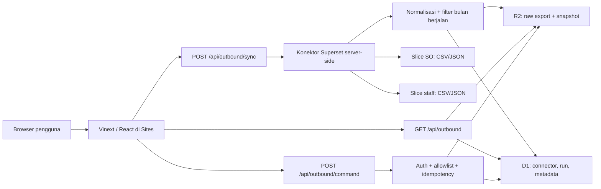

# CBT Outbound Operations Hub

Dashboard operasional outbound untuk memantau Supply Order (SO), merencanakan kapasitas picker, membuat assignment otomatis maupun manual, mengelola Wave/Drop dinamis, menyiapkan Bulk Upload WMS, dan memeriksa kualitas data pada grain yang benar: **Supply Order × Picking Zone**.

Versi ini mengganti alur Google Sheets + Apps Script dengan konektor Superset langsung dari server, snapshot Cloudflare R2, dan metadata/audit Cloudflare D1. Data mentah tetap berasal dari Superset; struktur bisnis sumber belum diubah agar migrasi skema dapat dikerjakan sebagai fase terpisah.

## Hasil utama

- Overview baru tanpa hero, animasi, atau 3D interaktif yang membebani browser.
- UI responsif, ringkas, memakai Bahasa Indonesia yang lebih operasional.
- Refresh Superset dapat dipicu melalui tombol **Sync sekarang**.
- Cookie Superset disimpan terenkripsi, memiliki status kedaluwarsa, dan dapat dirotasi dari halaman Konfigurasi.
- Sync selalu membatasi data ke bulan berjalan dalam zona waktu Asia/Jakarta.
- Snapshot terolah dilayani dari R2/D1 sehingga refresh tampilan tidak mengunduh ulang data Superset.
- Wave dan Drop menerima label bebas; jumlah maupun namanya tidak dikunci.
- Assignment picker mendukung rekomendasi dan mode manual dengan validasi detail.
- Visualisasi meliputi hourly throughput, backlog per zona, status order, scatter kapasitas picker, dan histogram kuantitas.
- Halaman Panduan berisi alur kerja interaktif dan troubleshooting.
- Tidak ada Google Sheets, Apps Script, DuckDB, WebGL, atau dependency charting besar.

## Arsitektur



### Mengapa D1 + R2, bukan DuckDB?

DuckDB sangat baik untuk analitik lokal dan query kolumnar, tetapi bukan komponen yang otomatis membuat pembacaan dashboard web lebih cepat. Untuk kebutuhan ini, proses terberat dilakukan sekali saat sync; hasilnya dipra-agregasi dan disimpan sebagai snapshot siap baca.

| Kebutuhan | Pilihan | Alasan |
|---|---|---|
| Metadata connector dan audit sync | Cloudflare D1 | Query kecil, konsisten, tersedia langsung pada runtime Sites |
| Raw export dan snapshot besar | Cloudflare R2 | Penyimpanan objek murah, egress gratis, tidak membebani row-read D1 |
| Transformasi data | Worker server-side | Tidak mengirim cookie atau raw export ke browser |
| Analitik lokal ad hoc | DuckDB opsional | Tidak diperlukan untuk jalur produksi |

Cloudflare memiliki free tier untuk D1 dan R2, tetapi “gratis” tetap berarti **selama penggunaan berada di kuota free tier**. Periksa batas terbaru pada dokumentasi resmi sebelum volume produksi meningkat:

- [Cloudflare D1 pricing](https://developers.cloudflare.com/d1/platform/pricing/)
- [Cloudflare R2 pricing](https://developers.cloudflare.com/r2/pricing/)

### Real-time yang realistis

Tanpa akses database, Superset API resmi, SQL Lab, atau kredensial machine-to-machine, sistem tidak dapat menjadi streaming real-time sejati. Implementasi ini memakai model **near-real-time on demand**:

1. pengguna menekan **Sync sekarang**;
2. server mengunduh dua slice Superset secara paralel;
3. data divalidasi dan dibatasi ke bulan berjalan;
4. snapshot baru ditulis secara atomik;
5. UI membaca snapshot terbaru.

Auto-refresh lima menit hanya membaca snapshot dan tidak terus-menerus memukul Superset. Ini sengaja memisahkan “refresh layar” dari “refresh sumber”.

## Kontrak data sumber

Parser menerima tab-separated, CSV, atau respons JSON Superset yang berisi array row. Header dinormalisasi tanpa mengubah arti bisnis.

### Slice Supply Order

Header yang telah diuji dari sample:

```text
so_date
supply_order_created_at
so_number
origin_id
origin_location_name
product_id
product_name
sku_number
l1_category_name
storage_handling
destination_location_name
status
remarks
supply_order_priority
origin_rack_name
picking_area_name
picking_staff_id
picker_name
picking_start_at
picking_end_at
SUM(request_quantity)
```

Aturan transformasi:

- tanggal operasi berasal dari `so_date`;
- zona berasal dari `picking_area_name`, lalu fallback ke `origin_rack_name`;
- quantity berasal dari `SUM(request_quantity)`;
- quantity dianggap selesai hanya bila `picking_end_at` terisi;
- satu SO multi-zona menghasilkan beberapa SO-zone split;
- distinct SO dan jumlah split dilaporkan terpisah;
- row di luar bulan berjalan Asia/Jakarta dibuang.

### Slice staff

Header yang telah diuji:

```text
date_key
drivers_join_date
schedule_start_time
staff_id
staff_name
schedule_role
schedule_description
checkin_time
is_active
```

Eligibility picker:

```text
is_active = true
checkin_time terisi
schedule_start_time terisi
schedule_role = OUTBOUND_PICKER_STAFF
schedule_description bukan Off Day
tenure_days >= 1
zone skill mencakup zona order
shift picker = shift order
```

Boundary MP Status tidak overlap:

| Tenure | MP Status |
|---|---|
| hari 1–7 | OJT 1 |
| hari 8–14 | OJT 2 |
| hari 15–20 | OJT 3 |
| hari 21+ | REGULER |

### Profil sample yang divalidasi

Sample pengguna menghasilkan:

- 51.951 line SO;
- 2.407 distinct SO;
- 2.460 kombinasi SO × zone;
- 24 zona picking;
- 787 row staff;
- 175 picker pada role sumber;
- 162 picker eligible pada filter sumber;
- 245.059 completed line quantity;
- 17 titik hourly throughput.

Semua 2.460 SO-zone awalnya belum memiliki mapping destination ke Wave/Drop. Ini diperlakukan sebagai isu konfigurasi yang terlihat, bukan diisi dengan tebakan.

## Logika domain

### Grain planning

Unit planning:

```text
so_number × picking_zone
```

Satu SO dapat berisi beberapa zona. Assignment final mengunci seluruh split SO ke satu picker agar kontrak WMS tetap konsisten.

### Wave dan Drop dinamis

Tidak ada enum atau daftar label permanen. Source of truth:

```text
effective_month
destination_code
destination_location_name
wave
drop
sequence
active
```

Label seperti `Wave 1`, `W-A`, `Ekstra Malam`, `Drop 5`, atau label baru lain diterima. Urutan memakai natural sort dan `sequence`. Destination tanpa rule diberi status `UNMAPPED` dan diblokir dari assignment otomatis.

### Assignment otomatis

Rekomendasi mempertimbangkan:

- status aktif dan check-in;
- role dan shift;
- skill zona;
- kapasitas target MP Status;
- load yang sudah dimiliki;
- konsistensi seluruh split SO;
- destination yang sudah terpetakan.

### Assignment manual

Mode manual bukan sekadar memilih hasil rekomendasi. Operator dapat memilih SO, zona/seluruh split, shift, dan picker. Sistem menampilkan guardrail:

- picker aktif;
- sudah check-in;
- role picker valid;
- shift cocok;
- skill zona cocok;
- kapasitas tidak terlampaui.

Override tetap tersedia untuk kebutuhan lapangan, tetapi mewajibkan catatan operator minimal delapan karakter agar keputusan dapat diaudit.

### Bulk Upload WMS

Kontrak output:

```csv
error_message,so_id,staff_id
```

Row hanya `READY` bila:

- semua split SO ikut dievaluasi;
- tidak ada proposal `UNASSIGNED`;
- semua split memakai picker yang sama;
- tidak ada status `OVER_TARGET_REVIEW`;
- tidak ada collision `so_id`;
- destination sudah memiliki Wave/Drop;
- field CSV dinetralkan dari formula injection.

## Area aplikasi

| Menu | Fungsi |
|---|---|
| Ringkasan | KPI inti dan visualisasi beban/throughput |
| Assign Picker | rekomendasi, manual assignment, staging, review |
| Zona | beban, kapasitas, dan pemerataan zona |
| Picker | roster, status, skill, target MP |
| Supply Order | pencarian dan filter SO |
| Checker | route checker dan progres |
| Laporan | ekspor, audit, dan kualitas data |
| Konfigurasi | konektor Superset, cookie, Wave/Drop, target |
| Panduan | alur penggunaan dan troubleshooting |

## Struktur proyek

```text
app/
  (dashboard)/
    guide/                  panduan operasional
    settings/               konfigurasi konektor dan rule
  api/outbound/
    route.ts                pembacaan snapshot
    command/route.ts        mutasi operasional
    config/route.ts         konfigurasi aman
    sync/route.ts           refresh Superset
components/
  layout/app-shell.tsx      navigasi, status sync, theme
  outbound/
    outbound-provider.tsx   state dan command client
    outbound-workspace.tsx  seluruh view operasional
  ui/primitives.tsx         komponen UI reusable
db/schema.ts                tabel D1
drizzle/                    migration SQL
lib/
  demo-data.ts              fallback deterministik
  outbound-logic.ts         business rules murni
  outbound-types.ts         kontrak domain
  runtime-storage.ts        D1, R2, dan enkripsi cookie
  superset-sync.ts          fetch, parse, transform
tests/                      unit, route, auth, asset
worker/index.ts             Worker entry dan security headers
```

## Prasyarat

- Node.js `>= 22.13.0`;
- npm dengan dukungan lockfile v3;
- dua Slice ID Superset yang dapat diekspor oleh sesi pengguna;
- cookie session Superset aktif;
- Sites project dengan D1 binding `DB` dan R2 binding `SNAPSHOTS`.

Verifikasi:

```powershell
node --version
npm --version
```

## Menjalankan lokal

### 1. Instal dependency

```powershell
npm ci
```

### 2. Siapkan environment

```powershell
Copy-Item .env.example .env.local
```

Isi nilai berikut:

| Variable | Wajib | Fungsi |
|---|---:|---|
| `OUTBOUND_ALLOW_ANONYMOUS_READ` | lokal | `true` untuk preview lokal tanpa login |
| `OUTBOUND_ADMIN_EMAILS` | production | email operator yang boleh sync/mutasi |
| `SUPERSET_ALLOWED_HOSTS` | production | allowlist host untuk mencegah SSRF |
| `SUPERSET_BASE_URL` | bootstrap | contoh `https://superset.company.internal` |
| `SUPERSET_SO_SLICE_ID` | bootstrap | Slice ID SO |
| `SUPERSET_STAFF_SLICE_ID` | bootstrap | Slice ID staff |
| `SUPERSET_EXPORT_PATH_TEMPLATE` | bootstrap | pola endpoint export |
| `SUPERSET_COOKIE_ENCRYPTION_KEY` | bila simpan cookie via UI | random secret minimal 32 karakter |
| `SUPERSET_SESSION_COOKIE` | opsional | alternatif cookie via secret env |
| `SUPERSET_COOKIE_EXPIRES_AT` | opsional | waktu kedaluwarsa ISO 8601 |

Buat encryption key:

```powershell
node -e "console.log(require('crypto').randomBytes(32).toString('base64url'))"
```

Jangan commit `.env.local`, cookie, token, atau hasil export mentah.

### 3. Jalankan development server

```powershell
npm run dev
```

Tanpa snapshot live, aplikasi memakai sample fallback dan memberi label sumber dengan jelas.

### 4. Jalankan quality gate

```powershell
npm run typecheck
npm run lint
npm test
npm audit --omit=dev
```

`npm test` sudah mencakup boundary MP Status, deadline Asia/Jakarta, eligibility picker, split multi-zona, over-target, collision `so_id`, CSV injection, Wave/Drop dinamis, assignment manual, auth API, server rendering, dan keberadaan asset production.

### 5. Uji production runtime lokal

```powershell
npm run build
npm start
```

`npm start` menjalankan Wrangler dari `dist/server/wrangler.json`.

## Setup Superset tanpa API/SQL Lab

### 1. Temukan Slice ID

1. buka chart SO di Superset;
2. lihat URL chart atau request Network;
3. catat numeric chart/slice ID;
4. ulangi untuk chart staff.

### 2. Verifikasi jalur export

Default:

```text
/api/v1/chart/{sliceId}/data/?format=csv&force=true
```

Karena instalasi Superset dapat berbeda, path dibuat configurable. Token yang tersedia:

| Token | Nilai |
|---|---|
| `{sliceId}` | ID chart/slice |
| `{from}` | awal bulan ISO |
| `{to}` | akhir bulan ISO |
| `{month}` | `YYYY-MM` Asia/Jakarta |

Contoh:

```text
/api/v1/chart/{sliceId}/data/?format=csv&force=true&from={from}&to={to}
```

Bila endpoint default ditolak, buka DevTools → Network, lakukan export CSV secara normal, lalu salin **path dan query** request yang berhasil. Jangan menyalin host lain atau URL HTTP.

### 3. Ambil cookie session

1. login Superset secara normal;
2. buka DevTools → Network;
3. pilih request export yang berhasil;
4. salin nilai request header `Cookie`;
5. catat waktu kedaluwarsa sesi;
6. buka **Konfigurasi → Koneksi Superset**;
7. masukkan base URL, Slice ID, path, cookie, dan waktu kedaluwarsa;
8. simpan;
9. klik **Uji & sync**.

Cookie tidak pernah dikirim kembali ke browser setelah disimpan. D1 hanya menyimpan ciphertext dan IV; key enkripsi berada di environment.

### 4. Rotasi cookie

Cookie memang akan kedaluwarsa dan tidak dapat diperbarui otomatis secara aman tanpa OAuth, API token, atau service account. Ketika status `COOKIE_EXPIRED`/`AUTH_FAILED` tampil:

1. login ulang ke Superset;
2. ambil cookie baru dari request export;
3. ganti cookie pada halaman Konfigurasi;
4. perbarui waktu kedaluwarsa;
5. simpan dan jalankan sync;
6. pastikan `last verified` dan jumlah row berubah.

Raw cookie tidak tampil pada log, response API, atau status UI.

## API

### Membaca snapshot

```http
GET /api/outbound?resource=dataset
GET /api/outbound?resource=staffRoster&page=1&pageSize=100
GET /api/outbound?resource=sos&status=READY%20TO%20SHIP
GET /api/outbound?resource=destinationRules&month=2026-07
```

### Memicu sync sumber

```http
POST /api/outbound/sync
Content-Type: application/json
Idempotency-Key: sync:2026-07-28:<uuid>
```

### Menyimpan konfigurasi

```http
POST /api/outbound/config
Content-Type: application/json
```

### Command operasional

```http
POST /api/outbound/command
Content-Type: application/json
Idempotency-Key: assignBatch:2026-07-28:<uuid>
```

Semua write:

- memerlukan user platform terautentikasi;
- memeriksa `OUTBOUND_ADMIN_EMAILS`;
- menolak cross-origin;
- memakai idempotency key;
- membatasi jumlah row dan ukuran payload;
- mencatat actor serta hasil.

## D1 dan R2

Binding yang digunakan:

```json
{
  "d1": "DB",
  "r2": "SNAPSHOTS"
}
```

Tabel D1:

- `sync_connector`: konfigurasi dan kesehatan connector;
- `sync_runs`: histori setiap refresh;
- `dataset_snapshots`: pointer snapshot aktif dan fallback kecil.

R2 menyimpan:

- raw SO bulan berjalan;
- raw staff bulan berjalan;
- snapshot hasil transformasi.

Runtime memastikan tabel tersedia. Untuk menghasilkan migration setelah perubahan schema:

```powershell
npm run db:generate
```

## Deployment ke Sites

Project sudah terhubung melalui `.openai/hosting.json`; jangan membuat project Sites baru.

### Deployment pertama atau pembaruan

1. pastikan `.openai/hosting.json` berisi `project_id`, `DB`, dan `SNAPSHOTS`;
2. jalankan `npm ci`;
3. jalankan `npm run typecheck`;
4. jalankan `npm run lint`;
5. jalankan `npm test`;
6. review `git diff` agar tidak ada cookie/secret/raw export;
7. commit exact source state;
8. push commit tersebut ke source repository Sites;
9. package source dari commit yang sama;
10. save Sites version memakai `commit_sha` exact;
11. set runtime environment dan secret;
12. deploy version sebagai private;
13. tunggu status terminal;
14. lakukan smoke test Ringkasan, Konfigurasi, Sync, Assign manual, dan Panduan.

### Environment production minimum

```text
OUTBOUND_ADMIN_EMAILS
SUPERSET_ALLOWED_HOSTS
SUPERSET_COOKIE_ENCRYPTION_KEY
```

Konfigurasi non-secret dan cookie kemudian dapat dimasukkan melalui UI. Alternatifnya, bootstrap semua `SUPERSET_*` melalui runtime environment.

### Rollback

1. pilih Sites version terakhir yang sehat;
2. deploy ulang version tersebut;
3. jangan menghapus snapshot saat investigasi;
4. cocokkan `run_id`, actor, waktu sync, dan idempotency key;
5. perbaiki pada branch baru;
6. jalankan quality gate;
7. rilis version berikutnya.

Setiap URL deployment Sites adalah production URL. Gunakan akses private kecuali data memang disetujui untuk publik.

## Performa dan keamanan

- tidak ada animasi CSS atau JavaScript pada alur operasional;
- tidak ada WebGL/3D runtime;
- chart memakai HTML/CSS ringan dan data teragregasi;
- SO dan tabel planning dipaginasi;
- transformasi besar berjalan server-side;
- dua export Superset diambil paralel;
- response dan route data memakai `no-store`;
- host Superset di-allowlist;
- hanya URL HTTPS dan same-origin command yang diterima;
- cookie dienkripsi AES-GCM;
- payload export dibatasi 45 MB;
- snapshot terakhir tetap tersedia bila Superset sementara gagal;
- security header mengaktifkan `nosniff`, frame denial, referrer policy, dan permissions policy.

## Monitoring

Pantau indikator berikut:

| Kondisi | Severity | Tindakan |
|---|---|---|
| cookie akan kedaluwarsa < 24 jam | warning | rotasi cookie |
| sync gagal 401/403/login HTML | critical | login ulang dan ganti cookie |
| sync lebih lama dari 30 menit | warning | cek konektivitas dan endpoint |
| jumlah row turun drastis | critical | bandingkan raw export |
| destination `UNMAPPED` bertambah | warning | tambah rule Wave/Drop |
| duplicate SO-zone | critical | audit kontrak sumber |
| collision `so_id` | critical | blok Bulk Upload |
| picker eligible kosong | critical | cek role, schedule, check-in |
| snapshot mendekati limit | warning | partition atau kompresi |

## Troubleshooting

### Sync mendapat 401/403

- cookie sudah kedaluwarsa;
- cookie berasal dari environment/domain yang berbeda;
- user tidak memiliki akses ke slice;
- `OUTBOUND_ADMIN_EMAILS` belum memuat email user.

### Sync menerima halaman login HTML

Cookie tidak valid atau request diarahkan ke SSO. Rotasi cookie dan gunakan path export yang terbukti berhasil di browser.

### Sync mendapat `HOST_NOT_ALLOWED`

Tambahkan hostname Superset yang tepat ke `SUPERSET_ALLOWED_HOSTS`. Jangan menambahkan wildcard global.

### Data tetap sample

- belum ada sync sukses;
- D1/R2 binding belum tersedia;
- endpoint membaca deployment berbeda;
- anonymous read lokal belum diaktifkan;
- snapshot live tidak lolos validasi.

### Picker tidak muncul

Periksa `is_active`, check-in, role, Off Day, shift, tenure, dan skill zona. Gunakan mode manual hanya bila override benar-benar dibutuhkan dan beri alasan.

### Destination tidak bisa di-assign

Tambahkan rule Wave/Drop aktif pada bulan berjalan. Label bebas dan tidak harus mengikuti nomor yang sudah ada.

### Build Windows gagal `EPERM ... dist/server/.wrangler`

Server preview lama masih mengunci folder build. Hentikan proses `wrangler dev`, lalu jalankan ulang `npm test`. Jangan menghapus folder workspace secara rekursif.

## Checklist UAT

- [ ] Overview tidak memiliki hero atau animasi.
- [ ] Tidak ada horizontal overflow pada mobile.
- [ ] distinct SO berbeda dari SO-zone split.
- [ ] data di luar bulan berjalan tidak ikut snapshot.
- [ ] tombol Sync sekarang menghasilkan sync run baru.
- [ ] cookie tidak pernah tampil kembali setelah disimpan.
- [ ] status cookie expired mudah dipahami.
- [ ] Wave/Drop baru dapat ditulis tanpa perubahan kode.
- [ ] picker noneligible tidak direkomendasikan.
- [ ] assignment manual memeriksa enam guardrail.
- [ ] override manual membutuhkan catatan.
- [ ] split parsial diblokir.
- [ ] satu SO menghasilkan satu picker final.
- [ ] CSV WMS hanya memiliki tiga kolom.
- [ ] checker dan laporan dapat dibuka.
- [ ] Panduan dapat dinavigasi.
- [ ] seluruh CSS/JS production mengembalikan HTTP 200.

## Batas fase ini

Struktur data sumber sengaja belum dimigrasikan. Fase perubahan struktur berikutnya sebaiknya mencakup:

1. current schema vs target schema;
2. field mapping dan ownership;
3. versi kontrak dataset;
4. adapter backward-compatible;
5. rekonsiliasi row count dan total quantity;
6. dual-read sebelum cutover;
7. freeze command saat cutover;
8. UAT dan rollback rehearsal.

Jangan mengubah grain `SO × zone` atau kontrak satu picker final per `so_id` tanpa keputusan bisnis dan perubahan kontrak WMS yang eksplisit.
