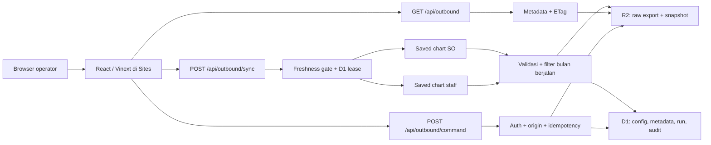

# CBT Outbound Operations Hub

Dashboard operasional outbound untuk memantau Supply Order (SO), merencanakan kapasitas picker, membuat assignment otomatis atau manual, mengelola Wave/Drop dinamis, menyiapkan Bulk Upload WMS, serta memeriksa produktivitas dan kualitas data pada grain **Supply Order × Picking Zone**.

Implementasi ini menggantikan Google Sheets dan Apps Script dengan konektor Superset server-side, snapshot Cloudflare R2, serta metadata dan audit Cloudflare D1. Data sumber tetap berasal dari chart Superset yang sudah disimpan; migrasi struktur data sengaja dipisahkan ke fase berikutnya.

## Kapabilitas utama

- Ringkasan ringkas tanpa hero, animasi dekoratif, WebGL, atau 3D yang membebani browser.
- Refresh Superset manual atau otomatis setiap 1–60 menit.
- Satu freshness gate di server mencegah banyak pengguna menarik sumber yang sama berulang kali.
- HTTP `ETag` menghindari pembacaan ulang objek R2 ketika snapshot belum berubah.
- Filter bawaan chart Superset tetap digunakan dan hasil `applied_filters`/`rejected_filters` dicatat.
- Filter halaman bekerja sebagai filter lanjutan di atas snapshot, bukan mengganti query chart sumber.
- Cookie Superset disimpan terenkripsi dan tidak pernah dikirim kembali ke browser.
- Data otomatis dibatasi ke bulan berjalan dalam zona waktu warehouse.
- Wave, Drop, tujuan, shift, jadwal, dan warehouse tidak dikunci ke daftar statis.
- Assignment picker mendukung rekomendasi, multi-filter, pemilihan banyak Staff ID/nama, balanced load, round-robin, dan override dengan alasan.
- Dashboard Picker menampilkan Top 10, durasi, unit per jam, per hari, per SKU, per SO, picker on duty, serta tren rata-rata qty harian/jam.
- Supply Order memiliki filter lengkap, pencarian SKU/produk/remark, sorting, dan detail SKU.
- Semua tabel operasional dapat diurutkan; angka utama chart ditampilkan langsung agar terbaca saat screenshot.
- Panduan memuat alur interaktif, kalkulator estimasi kuota, troubleshooting, dan roadmap multi-warehouse.

## Arsitektur



### Mengapa D1 + R2, bukan DuckDB?

DuckDB unggul untuk analitik lokal dan query kolumnar, tetapi tidak otomatis membuat dashboard web multi-pengguna lebih cepat. Jalur produksi ini melakukan transformasi sekali saat sync, lalu menyimpan snapshot siap baca.

| Kebutuhan | Komponen | Alasan |
|---|---|---|
| Config, lease, pointer snapshot, dan audit | Cloudflare D1 | Query kecil, konsisten, dekat dengan Worker |
| Raw export dan snapshot besar | Cloudflare R2 | Object storage, tidak menghabiskan D1 row reads |
| Transformasi | Worker server-side | Cookie dan raw data tidak masuk browser |
| Eksplorasi ad hoc lokal | DuckDB opsional | Tidak dibutuhkan untuk serving dashboard |

### Cara kuota refresh dihitung

Kuota D1 Free adalah **baris yang dibaca query**, bukan “lima juta kali refresh”. Setiap query tetap terakumulasi per hari, dan query tanpa indeks dapat membaca lebih banyak baris daripada jumlah hasilnya. Implementasi ini menyimpan payload besar di R2; D1 hanya membaca beberapa row config/metadata/lease.

Perkiraan konservatif untuk 50 browser aktif dengan interval 5 menit:

| Item | Perhitungan | Estimasi |
|---|---:|---:|
| Siklus per hari | `1.440 / 5` | 288 |
| Worker requests | `50 × 288 × 2` | 28.800/hari |
| D1 row reads | `50 × 288 × 3` | 43.200/hari |
| R2 `GetObject` | `50 × 288 × 30` | 432.000/bulan |
| Sync Superset maksimum | `288 × 2 slice` | 576 request slice/hari |

Angka aktual biasanya lebih rendah karena:

1. freshness gate membuat semua pengguna berbagi satu snapshot;
2. D1 lease mencegah sync bersamaan;
3. respons `304 Not Modified` menghentikan alur sebelum `R2 GetObject`;
4. sync otomatis dilewati selama snapshot masih segar;
5. query operasional memakai primary key atau indeks.

Kalkulator interaktif yang sama tersedia di **Panduan → Kalkulator kuota**. Pantau tiga kuota secara terpisah: Worker requests, D1 rows read/write, dan R2 Class A/B operations.

Dokumentasi resmi:

- [Cloudflare D1 pricing](https://developers.cloudflare.com/d1/platform/pricing/)
- [Cloudflare R2 pricing](https://developers.cloudflare.com/r2/pricing/)
- [Cloudflare Workers limits](https://developers.cloudflare.com/workers/platform/limits/)

## Model sinkronisasi

Tanpa akses database, SQL Lab, API token, atau service account Superset, integrasi ini adalah **near-real-time berbasis saved chart dan session cookie**, bukan event streaming.

### Alur refresh

1. Browser memanggil sync dalam mode `auto` atau `manual`.
2. Server membaca interval connector dan waktu snapshot terakhir.
3. Mode `auto` berhenti cepat bila snapshot masih segar.
4. D1 lease memastikan hanya satu sync lintas pengguna yang berjalan.
5. Dua saved chart Superset diambil paralel.
6. Query context yang tersimpan pada chart tetap menjadi baseline.
7. Respons divalidasi, filter diterapkan/ditolak dicatat, dan data dibatasi ke bulan berjalan.
8. Raw export serta snapshot baru ditulis ke R2.
9. Pointer snapshot dan histori sync diperbarui di D1.
10. Browser membaca metadata; payload R2 hanya diambil bila `ETag` berubah.

Tombol **Refresh data** memulai mode manual. Refresh otomatis memakai interval 1, 2, 3, 5, 10, 15, 30, atau 60 menit. Bila Superset gagal, snapshot terakhir tetap tersedia dan UI menjelaskan penyebabnya.

### Filter Superset dan filter web

Default endpoint:

```text
/api/v1/chart/{sliceId}/data/?format=json&type=full&force=true
```

Endpoint tersebut memakai query context yang disimpan bersama chart. Karena itu filter waktu, datasource, adhoc filter, metric, dan konfigurasi chart yang tersimpan tetap menjadi baseline. Aplikasi membaca metadata `applied_filters` dan `rejected_filters` bila tersedia.

Filter di halaman web—misalnya Wave, Drop, shift, remark, MP status, zone, tanggal, atau picker—menyaring snapshot yang sudah lolos baseline Superset. Aplikasi tidak membangun ulang query context dengan `POST /api/v1/chart/data`; ini sengaja dipilih agar integrasi tetap maintainable tanpa akses API resmi.

Referensi resmi:

- [Superset: chart data dari query context tersimpan](https://superset.apache.org/developer-docs/api/return-payload-data-response-for-a-chart/)
- [Superset: query chart data eksplisit](https://superset.apache.org/developer-docs/api/return-payload-data-response-for-the-given-query-chart-data/)

## Kontrak data

Parser menerima JSON Superset, CSV, atau tab-separated text. Nama header dinormalisasi tanpa mengubah arti bisnis.

### Slice Supply Order

Kolom utama yang didukung:

```text
so_date
supply_order_created_at
so_number
origin_id
origin_location_name
product_id
product_name
sku_number
l1_category_name
storage_handling
quantity
destination_id
destination_name
so_status
remark
picking_zone
picking_start_at
picking_end_at
picking_staff_id
picking_staff_name
```

Aturan:

- satu SO dapat memiliki banyak SKU;
- satu SO multi-zona menghasilkan beberapa SO-zone split;
- `distinct SO` tidak sama dengan jumlah split;
- quantity selalu dijumlahkan dari line item;
- detail SKU tetap tersedia pada halaman Supply Order;
- produktivitas memakai `picking_end_at`, picker, quantity, SKU, dan SO bila kolomnya tersedia.

### Slice staff

Kolom utama yang didukung:

```text
date_key
drivers_join_date
schedule_start_time
schedule_end_time
schedule_description
schedule_role
staff_id
staff_name
attendance_check_in
attendance_check_out
mp_status
zone
```

Picker eligible harus aktif, memiliki Staff ID/nama, sesuai role, tidak Off Day, dan memenuhi guardrail jadwal/check-in yang berlaku. Assignment manual dapat memperluas kandidat, tetapi override tetap membutuhkan alasan.

### Grain domain

| Entitas | Grain |
|---|---|
| KPI Supply Order | distinct `so_id` |
| Planning / assignment | `so_id × picking_zone` |
| Detail SKU | `so_id × sku_number` |
| Produktivitas harian | `picker × calendar_date` |
| Produktivitas jam | `picker × calendar_date × hour` |
| Staff on duty | `staff_id × schedule_date` |

## Fitur per halaman

| Halaman | Isi |
|---|---|
| Ringkasan | KPI, throughput, beban zona, status, dan nilai chart langsung |
| Assign Picker | multi-filter, rekomendasi, manual bulk, balanced/round-robin, validasi |
| Zona | beban, kapasitas, dan pemerataan |
| Picker | Top 10, roster, on duty, durasi, tren harian/jam, qty per picker/SO/SKU |
| Supply Order | filter lengkap, pencarian, sorting, dan detail SKU |
| Checker | route checker, progres, dan sorting |
| Laporan | audit, kualitas data, dan ekspor |
| Konfigurasi | warehouse profile, Superset, cookie, interval, Wave/Drop, target |
| Panduan | alur interaktif, kalkulator kuota, troubleshooting, dan ekspansi warehouse |

## Struktur proyek

```text
app/
  (dashboard)/             route halaman
  api/outbound/
    route.ts               pembacaan snapshot + ETag
    command/route.ts       mutasi operasional
    config/route.ts        connector aman
    sync/route.ts          freshness gate + refresh Superset
components/
  layout/app-shell.tsx     navigasi, status, tema
  outbound/
    outbound-provider.tsx  state, cache, command client
    outbound-workspace.tsx seluruh workspace operasional
db/schema.ts               schema D1
drizzle/                   migration SQL
lib/
  demo-data.ts             fallback deterministik
  outbound-logic.ts        business rules murni
  outbound-types.ts        kontrak domain
  request-auth.ts          auth platform + localhost guard
  runtime-storage.ts       D1, R2, ETag, enkripsi cookie
  superset-sync.ts         fetch, parse, transform, filter metadata
tests/                     unit, route, auth, rendering, asset
worker/index.ts            Worker entry + security headers
```

Folder template `examples/d1` telah dihapus karena tidak dipakai runtime dan berpotensi membingungkan schema produksi.

## Prasyarat

- Node.js `>= 22.13.0`;
- npm dengan lockfile v3;
- dua Slice ID Superset yang dapat diakses sesi operator;
- session cookie Superset aktif;
- Sites project dengan binding D1 `DB` dan R2 `SNAPSHOTS`.

```powershell
node --version
npm --version
```

## Menjalankan lokal

### 1. Instal dependency

```powershell
npm ci
```

### 2. Siapkan runtime development

Untuk UI Vite:

```powershell
Copy-Item .env.example .env.local
```

Untuk runtime Wrangler production-like:

```powershell
Copy-Item .dev.vars.example .dev.vars
```

`.env.local` tidak otomatis dibaca oleh `wrangler dev`. Script `npm start` secara eksplisit memakai `--env-file .dev.vars`. File `.dev.vars` di-ignore Git; hanya `.dev.vars.example` yang boleh di-commit.

Variable penting:

| Variable | Wajib | Fungsi |
|---|---:|---|
| `OUTBOUND_ALLOW_LOCAL_ADMIN` | lokal | izinkan write hanya untuk hostname localhost |
| `OUTBOUND_ALLOW_ANONYMOUS_READ` | lokal/preview | izinkan snapshot dibaca tanpa login |
| `OUTBOUND_ADMIN_EMAILS` | production | allowlist operator admin |
| `OUTBOUND_WAREHOUSE_CODE` | bootstrap | kode warehouse, contoh `CBT` |
| `OUTBOUND_WAREHOUSE_NAME` | bootstrap | nama warehouse |
| `OUTBOUND_WAREHOUSE_TIMEZONE` | bootstrap | zona waktu IANA |
| `SUPERSET_ALLOWED_HOSTS` | semua runtime | allowlist host, tanpa wildcard global |
| `SUPERSET_BASE_URL` | bootstrap | base URL HTTPS Superset |
| `SUPERSET_SO_SLICE_ID` | bootstrap | numeric Slice ID SO |
| `SUPERSET_STAFF_SLICE_ID` | bootstrap | numeric Slice ID staff |
| `SUPERSET_EXPORT_PATH_TEMPLATE` | opsional | default endpoint JSON saved chart |
| `SUPERSET_REFRESH_INTERVAL_MINUTES` | opsional | 1–60 menit |
| `SUPERSET_COOKIE_ENCRYPTION_KEY` | production | secret minimal 32 karakter |
| `SUPERSET_SESSION_COOKIE` | opsional | bootstrap cookie melalui secret env |
| `SUPERSET_COOKIE_EXPIRES_AT` | opsional | waktu kedaluwarsa ISO 8601 |

Buat encryption key:

```powershell
node -e "console.log(require('crypto').randomBytes(32).toString('base64url'))"
```

Jangan commit `.env.local`, `.dev.vars`, cookie, secret, log, atau raw export.

### 3. Development UI

```powershell
npm run dev
```

Tanpa snapshot live, aplikasi memakai sample fallback dan menandainya dengan jelas.

### 4. Production-like local runtime

```powershell
npm run build
npm start
```

`npm start` adalah server long-running. Terminal harus tetap terbuka. Hentikan dengan `Ctrl+C`; respons API 401 tidak menghentikan proses.

Uji:

```powershell
Invoke-RestMethod http://localhost:3000/api/outbound/config
Invoke-WebRequest http://localhost:3000/api/outbound?resource=dataset
```

### 5. Quality gate

```powershell
npm run typecheck
npm run lint
npm test
npm audit --omit=dev
```

`npm test` mencakup boundary MP Status, deadline Asia/Jakarta, eligibility picker, split multi-zona, over-target, collision `so_id`, CSV injection, Wave/Drop dinamis, assignment manual, auth API, server rendering, dan asset production.

## Konfigurasi Superset

### 1. Temukan Slice ID

1. Login ke Superset.
2. Buka chart SO yang sudah disimpan.
3. Ambil numeric chart/slice ID dari URL atau Network.
4. Ulangi untuk chart staff.
5. Pastikan kedua chart dapat dibuka oleh sesi yang sama.

### 2. Ambil session cookie

1. Buka DevTools → Network.
2. Pilih request chart yang berhasil.
3. Salin request header `Cookie`.
4. Buka **Konfigurasi → Koneksi Superset**.
5. Isi Base URL, Slice ID SO, Slice ID staff, cookie, dan interval.
6. Isi profil warehouse.
7. Klik **Simpan koneksi**.
8. Klik **Uji dan tarik data**.
9. Periksa jumlah row, waktu sync, serta applied/rejected filters.

Cookie tidak ditampilkan kembali setelah disimpan. D1 hanya menyimpan ciphertext dan IV; encryption key berada di runtime environment.

### 3. Rotasi cookie

Cookie session pasti memiliki masa berlaku dan tidak aman diperbarui otomatis tanpa OAuth, API token, atau service account.

Saat `COOKIE_EXPIRED`, `AUTH_FAILED`, 401, 403, atau halaman login HTML muncul:

1. Login ulang ke Superset.
2. Ambil cookie baru.
3. Ganti cookie pada halaman Konfigurasi.
4. Simpan dan sync.
5. Pastikan timestamp serta jumlah row berubah.

Raw cookie tidak boleh masuk log, screenshot yang dibagikan, response API, atau Git.

## API

### Membaca data

```http
GET /api/outbound?resource=dataset
If-None-Match: "snapshot-<syncedAt>"

GET /api/outbound?resource=staffRoster&page=1&pageSize=100
GET /api/outbound?resource=sos&status=READY%20TO%20SHIP
GET /api/outbound?resource=destinationRules&month=2026-07
```

Snapshot dapat merespons `304 Not Modified` tanpa membaca objek R2.

### Memicu sync

```http
POST /api/outbound/sync
Content-Type: application/json
Idempotency-Key: sync:<uuid>

{"mode":"manual"}
```

Mode `manual` membutuhkan admin. Mode `auto` dapat dipanggil pembaca anonim bila `OUTBOUND_ALLOW_ANONYMOUS_READ=true`, tetapi selalu tunduk pada freshness gate dan D1 lease.

### Menyimpan konfigurasi

```http
POST /api/outbound/config
Content-Type: application/json
```

### Command operasional

```http
POST /api/outbound/command
Content-Type: application/json
Idempotency-Key: assignBatch:<uuid>
```

Semua write production:

- membutuhkan user platform terautentikasi;
- memeriksa `OUTBOUND_ADMIN_EMAILS`;
- menolak cross-origin;
- memakai idempotency key;
- membatasi jumlah row dan ukuran payload;
- mencatat actor dan hasil.

## D1 dan R2

### Tabel D1

- `sync_connector`: source, warehouse profile, interval, encrypted cookie, dan lease atomik;
- `sync_runs`: histori refresh;
- `dataset_snapshots`: object key dan metadata snapshot aktif.

Rule Wave/Drop dan command operasional saat ini disimpan bersama snapshot agar tetap konsisten dengan version data. Pemisahan menjadi tabel per warehouse direncanakan pada fase multi-connector.

Migration terbaru menambahkan:

```text
warehouse_code
warehouse_name
warehouse_timezone
```

Apply migration melalui lifecycle deployment Sites. Jangan menjalankan DDL manual pada production binding.

### Object R2

- raw export SO per run;
- raw export staff per run;
- dataset terolah per run;
- pointer aktif disimpan di D1.

Retention raw export perlu ditinjau berkala. Snapshot aktif jangan dihapus saat investigasi atau rollback.

## Persiapan multi-warehouse

Fase ini sudah menghapus hardcode tampilan CBT dari sidebar dan membawa profil warehouse di connector serta dataset:

```text
code
name
timezone
```

Tujuan, Wave, Drop, jadwal, dan routing berasal dari data/rule dan tidak dikunci. Arsitektur siap di-partition dengan key:

```text
warehouse_code / month / run_id
```

Tahap ekspansi yang direkomendasikan:

1. validasi satu warehouse pilot;
2. tambahkan registry connector per warehouse;
3. pindahkan primary key config/rule agar menyertakan `warehouse_code`;
4. pisahkan R2 prefix per warehouse;
5. tambahkan warehouse switcher berbasis hak akses;
6. tetapkan timezone, target, Wave/Drop, dan schedule vocabulary per warehouse;
7. jalankan dual-read serta rekonsiliasi;
8. rollout bertahap per region;
9. tambahkan consolidated national view dari snapshot agregat, bukan raw row.

Saat ini satu deployment memakai **satu profil warehouse aktif**. Multi-connector simultan dan akses lintas warehouse adalah fase berikutnya agar isolasi data dan otorisasi tidak dibuat setengah matang.

## Deployment ke Sites

Project telah terhubung melalui `.openai/hosting.json`. Jangan membuat project Sites baru.

### Release

1. Tarik source terbaru dan pastikan branch yang benar.
2. Jalankan `npm ci`.
3. Jalankan `npm run typecheck`.
4. Jalankan `npm run lint`.
5. Jalankan `npm test`.
6. Jalankan `npm audit --omit=dev`.
7. Review `git diff` dan `git status`.
8. Pastikan tidak ada cookie, `.dev.vars`, raw export, atau log.
9. Commit exact source state.
10. Push commit tersebut ke source repository Sites.
11. Package source dari commit yang sama.
12. Save Sites version memakai exact `commit_sha`.
13. Atur runtime variable dan secret.
14. Deploy version sebagai **private**.
15. Tunggu status terminal.
16. Smoke test Ringkasan, Konfigurasi, refresh, Assign manual, Picker, Supply Order, dan Panduan.
17. Catat version ID serta hasil UAT.

Environment minimum:

```text
OUTBOUND_ADMIN_EMAILS
OUTBOUND_ALLOW_ANONYMOUS_READ
OUTBOUND_WAREHOUSE_CODE
OUTBOUND_WAREHOUSE_NAME
OUTBOUND_WAREHOUSE_TIMEZONE
SUPERSET_ALLOWED_HOSTS
SUPERSET_COOKIE_ENCRYPTION_KEY
```

Jangan set `OUTBOUND_ALLOW_LOCAL_ADMIN` di production.

### Rollback

1. Pilih version Sites terakhir yang sehat.
2. Deploy ulang version tersebut.
3. Jangan menghapus snapshot.
4. Cocokkan `run_id`, actor, timestamp, dan idempotency key.
5. Perbaiki pada branch baru.
6. Jalankan quality gate.
7. Rilis version berikutnya.

Setiap deployment URL Sites adalah production URL. Gunakan akses private kecuali data telah disetujui untuk publik.

## Performa dan keamanan

- tidak ada animasi CSS/JS pada alur operasional;
- tidak ada WebGL, 3D runtime, atau dependency charting besar;
- chart memakai HTML/CSS ringan dan agregasi terkontrol;
- data table besar dipaginasi atau dibatasi;
- dua chart Superset diambil paralel;
- freshness gate, Web Locks, dan D1 lease mencegah sync ganda;
- snapshot memakai ETag dan conditional request;
- schema initialization di-cache per Worker isolate;
- host Superset di-allowlist;
- hanya HTTPS dan same-origin command yang diterima;
- cookie dienkripsi AES-GCM;
- payload export dibatasi 45 MB;
- snapshot terakhir tetap tersedia saat sumber gagal;
- security header mengaktifkan `nosniff`, frame denial, referrer policy, dan permissions policy.

## Monitoring

| Kondisi | Severity | Tindakan |
|---|---|---|
| Worker requests mendekati kuota | warning | naikkan interval atau gunakan satu display bersama |
| D1 row reads melonjak | warning | periksa query plan dan indeks |
| R2 Class B meningkat | warning | audit ETag, polling, dan browser aktif |
| cookie akan kedaluwarsa <24 jam | warning | rotasi cookie |
| 401/403/login HTML Superset | critical | login ulang dan ganti cookie |
| sync lebih lama dari interval | warning | cek endpoint, ukuran export, dan konektivitas |
| jumlah row turun drastis | critical | bandingkan applied filter dan raw export |
| filter ditolak Superset | warning | perbaiki saved chart |
| destination `UNMAPPED` bertambah | warning | tambah rule Wave/Drop |
| duplicate SO-zone | critical | audit kontrak sumber |
| collision `so_id` | critical | blok Bulk Upload |
| picker eligible kosong | critical | cek role, schedule, check-in, dan MP status |

## Troubleshooting

### `GET /api/outbound/config 401 Unauthorized` saat localhost

Penyebab paling umum: runtime Wrangler tidak memuat variable local admin. Pastikan:

```powershell
Copy-Item .dev.vars.example .dev.vars
npm run build
npm start
```

Lalu periksa:

```text
OUTBOUND_ALLOW_LOCAL_ADMIN=true
OUTBOUND_ALLOW_ANONYMOUS_READ=true
```

Bypass ini hanya berlaku untuk `localhost`, `127.0.0.1`, atau `::1`; hostname lain tetap memerlukan identitas platform dan admin allowlist.

### UI menampilkan `Failed to fetch`

Ini berarti browser tidak menerima respons HTTP sama sekali, umumnya karena:

- `npm start` tidak sedang berjalan;
- terminal server ditutup;
- port berbeda;
- build lama belum dibuat;
- Worker proxy lokal terputus;
- browser membuka origin yang berbeda.

Jalankan server di terminal terpisah dan biarkan tetap terbuka. Pesan UI kini membedakan kegagalan jaringan, 401 aplikasi, cookie expired, host ditolak, dan respons login HTML.

### `npm start` tiba-tiba berhenti

Respons route 401 tidak mematikan Wrangler. Baca log Wrangler paling akhir dan cari error setelah proses berakhir. Jika log hanya menunjukkan proxy/controller disconnect setelah durasi panjang, proses kemungkinan ditutup, terminal terputus, komputer sleep, atau port direbut proses lain.

### Sync Superset 401/403

- cookie kedaluwarsa;
- cookie berasal dari domain/environment berbeda;
- user cookie tidak boleh membaca slice;
- chart diarahkan ke SSO;
- admin production belum masuk `OUTBOUND_ADMIN_EMAILS`.

### Sync menerima HTML login

Cookie tidak valid atau request dialihkan ke SSO. Rotasi cookie dan gunakan endpoint chart yang terbukti berhasil dari browser.

### `HOST_NOT_ALLOWED`

Tambahkan hostname tepat ke `SUPERSET_ALLOWED_HOSTS`. Jangan gunakan wildcard global.

### Data tetap sample

- belum ada sync sukses;
- D1/R2 binding tidak tersedia;
- deployment membaca binding berbeda;
- snapshot live tidak lolos validasi;
- source gagal dan fallback sample dipertahankan.

### Picker tidak muncul

Periksa active status, Staff ID, role, Off Day, shift, jadwal, check-in, tenure, zone skill, dan MP status. Gunakan manual override hanya dengan alasan operasional yang dapat diaudit.

### Destination belum memiliki routing

Tujuan baru tetap muncul otomatis dari data sebagai `UNMAPPED`. Tambahkan rule Wave/Drop di Konfigurasi. Label bebas dan tidak harus mengikuti daftar lama.

### Windows `EPERM ... dist/server/.wrangler`

Server preview lama masih mengunci folder build. Hentikan proses `wrangler dev`, lalu jalankan ulang build. Jangan menghapus workspace secara rekursif.

## Checklist UAT

- [ ] Ringkasan tidak memiliki hero atau animasi.
- [ ] Sidebar tidak menampilkan card CBT Supervisor.
- [ ] Tidak ada horizontal overflow desktop/mobile.
- [ ] Hanya satu popover filter terbuka pada satu waktu.
- [ ] Escape dan klik di luar menutup popover.
- [ ] Semua tabel dapat diurutkan dan memiliki `aria-sort`.
- [ ] Nilai chart terbaca pada screenshot.
- [ ] distinct SO berbeda dari SO-zone split.
- [ ] data di luar bulan berjalan tidak masuk snapshot.
- [ ] refresh manual menghasilkan sync run baru.
- [ ] refresh otomatis melewati source bila snapshot masih segar.
- [ ] request dataset yang sama mendapat `304`.
- [ ] cookie tidak pernah ditampilkan kembali.
- [ ] applied/rejected filter saved chart terlihat di Konfigurasi.
- [ ] Wave/Drop baru dapat ditulis tanpa perubahan kode.
- [ ] tujuan baru muncul sebagai routing `UNMAPPED`.
- [ ] picker noneligible tidak direkomendasikan.
- [ ] filter Assign dapat memilih banyak jadwal, status, zone, remark, dan shift.
- [ ] manual assign dapat memilih banyak Staff ID/nama.
- [ ] balanced dan round-robin menghasilkan pembagian masuk akal.
- [ ] override membutuhkan catatan.
- [ ] split parsial diblokir.
- [ ] satu SO memiliki satu picker final.
- [ ] Top 10 dan tren produktivitas harian/jam tampil.
- [ ] detail Supply Order menampilkan SKU.
- [ ] semua CSS/JS production mengembalikan HTTP 200.

## Batas fase ini

Struktur data sumber sengaja belum dimigrasikan. Fase perubahan struktur berikutnya sebaiknya mencakup:

1. current schema vs target schema;
2. field mapping dan ownership;
3. versi kontrak dataset;
4. adapter backward-compatible;
5. rekonsiliasi row count, quantity, dan filter;
6. dual-read sebelum cutover;
7. freeze command saat cutover;
8. UAT dan rollback rehearsal.

Jangan mengubah grain `SO × zone` atau kontrak satu picker final per `so_id` tanpa keputusan bisnis dan perubahan kontrak WMS yang eksplisit.
